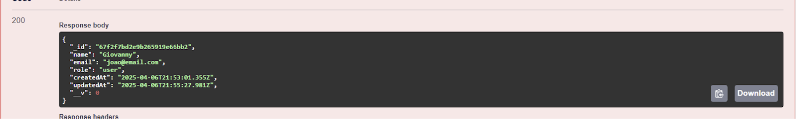
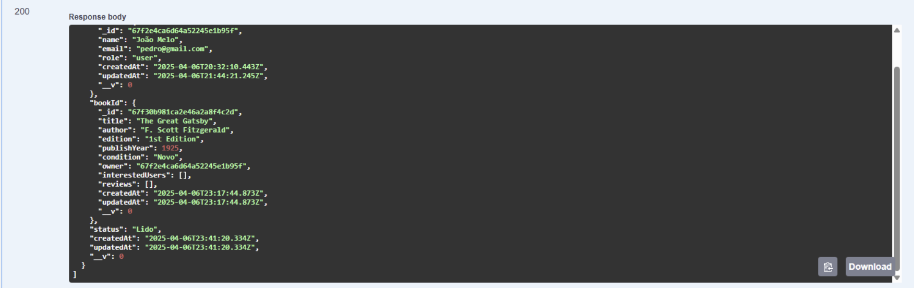
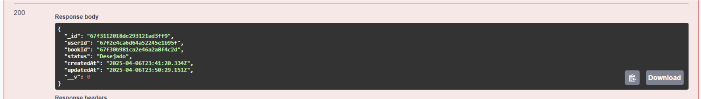

# APIs e Web Services

O projeto SAVEBOOK tem como objetivo principal criar uma comunidade online para leitores, permitindo a troca e doação de livros, avaliações de obras, sugestões personalizadas e interação entre usuários. Para isso, será desenvolvida uma API RESTful que servirá de ponte entre o frontend (web/mobile) e o backend, oferecendo os serviços essenciais para o funcionamento da plataforma.

## Objetivos da API

A API do SAVEBOOK tem como principal objetivo permitir que usuários se cadastrem, publiquem livros para doação ou troca, interajam entre si, avaliem livros e organizem suas leituras. A API será usada por clientes externos, como o frontend web em React e o aplicativo mobile em React Native. Entre os principais recursos oferecidos estão:

-Cadastro e login de usuários (incluindo autenticação via Google e Facebook);

-Registro e visualização de livros disponíveis;

-Envio de notificações sobre interesse em livros;

-Avaliação e recomendação de livros;

-Criação de eventos de troca e feed de interação entre leitores.

## Modelagem da Aplicação

A modelagem da aplicação inclui as principais entidades do sistema:

-Usuário: nome, e-mail, senha, foto de perfil, preferências literárias.

-Livro: título, autor, edição, estado de conservação, foto, status (disponível ou não).

-Interesse: vínculo entre usuários interessados e donos de livros.

-Avaliação: nota de 1 a 5, comentário e referência ao livro e ao usuário.

-Evento: data, local (presencial ou virtual), regras e participantes.

-Notificações: geradas via Firebase Messaging.

Os dados serão armazenados em um banco MongoDB, com uso do Mongoose para modelagem dos schemas.

## Tecnologias Utilizadas

As principais tecnologias adotadas para a API são:

-Node.js com Express para desenvolvimento da API;

-MongoDB com Mongoose para gerenciamento do banco de dados;

-Firebase Authentication para login e autenticação de usuários;

-Firebase Cloud Messaging para envio de notificações;

-Vercel para deploy do frontend;

-Azure para hospedagem do banco de dados;

-Git e GitHub para versionamento;

-Tailwind CSS no frontend para estilização responsiva.

## API Endpoints

Users: 
Endpoint 1
Método: POST
URL: /api/users
Parâmetros:
param1: {
 "name": "Pedro Henrique",
 "email": "pedro@gmail.com",
 "password": "123456789"
}
Resposta:
Sucesso (201 CREATED)
{
  "name": "Pedro Henrique",
  "email": "pedro@gmail.com",
  "role": "user",
  "_id": "67f2e4ca6d64a52245e1b95f",
  "createdAt": "2025-04-06T20:32:10.443Z",
  "updatedAt": "2025-04-06T20:32:10.443Z",
  "__v": 0
}

Endpoint 2
Método: GET
URL: /api/users
Resposta:
Sucesso (200 OK)
[
  {
    "_id": "67f2e4ca6d64a52245e1b95f",
    "name": "Pedro Henrique",
    "email": "pedro@gmail.com",
    "role": "user",
    "createdAt": "2025-04-06T20:32:10.443Z",
    "updatedAt": "2025-04-06T20:32:10.443Z",
    "__v": 0
  }
]

Endpoint 3
Método: GET
URL: /api/users/{id}
Parâmetros:
path: id do usuário
Resposta:
Sucesso (200 OK)
{
  "_id": "67f2e4ca6d64a52245e1b95f",
  "name": "Pedro Henrique",
  "email": "pedro@gmail.com",
  "role": "user",
  "createdAt": "2025-04-06T20:32:10.443Z",
  "updatedAt": "2025-04-06T20:32:10.443Z",
  "__v": 0
}

Endpoint 4
Método: PATCH
URL: /api/users/{id}
Parâmetros:
path: id do usuário
params: {
  "name": "João Melo"
}

Resposta:
Sucesso (200 OK)
{
  "_id": "67f2e4ca6d64a52245e1b95f",
  "name": "João Melo",
  "email": "pedro@gmail.com",
  "role": "user",
  "createdAt": "2025-04-06T20:32:10.443Z",
  "updatedAt": "2025-04-06T20:32:10.443Z",
  "__v": 0
}

Endpoint 5
Método: PATCH
URL: /api/users/{id}/password
Parâmetros:
path: id do usuário
params: {
  "oldPassword": "senhaAntiga123",
  "newPassword": "novaSenhaSegura456"
}

Resposta:
Sucesso (200 OK)
{
  "_id": "67f2e4ca6d64a52245e1b95f",
  "name": "João Melo",
  "email": "pedro@gmail.com",
  "role": "user",
  "createdAt": "2025-04-06T20:32:10.443Z",
  "updatedAt": "2025-04-06T20:32:10.443Z",
  "__v": 0
}
Endpoint 6
Método: DELETE
URL: /api/users/{id}
Parâmetros:
path: id do usuário
Resposta:
Sucesso (200 OK)
{
  "_id": "67f2f7bd2e9b265919e66bb2",
  "name": "Giovanny",
  "email": "joao@email.com",
  "role": "user",
  "createdAt": "2025-04-06T21:53:01.355Z",
  "updatedAt": "2025-04-06T21:55:27.981Z",
  "__v": 0
}

Books:
Endpoint 7
Método: POST
URL: /api/books
Parâmetros:
param1: {
  "title": "The Great Gatsby",
  "author": "F. Scott Fitzgerald",
  "coverUrl": "https://example.com/cover.jpg",
  "description": "A story about the American dream...",
  "edition": "1st Edition",
  "publishYear": 1925,
  "condition": "Novo",
  "owner": "67f2e4ca6d64a52245e1b95f"
}

Resposta:
Sucesso (201 CREATED)
{
  "title": "The Great Gatsby",
  "author": "F. Scott Fitzgerald",
  "edition": "1st Edition",
  "publishYear": 1925,
  "condition": "Novo",
  "owner": "67f2e4ca6d64a52245e1b95f",
  "interestedUsers": [],
  "reviews": [],
  "_id": "67f307ec2f6bb9ae23af9259",
  "createdAt": "2025-04-06T23:02:04.057Z",
  "updatedAt": "2025-04-06T23:02:04.057Z",
  "__v": 0
}

Endpoint 8
Método: GET
URL: /api/books
Resposta:
Sucesso (200 OK)
[
  {
    "_id": "67f307ec2f6bb9ae23af9259",
    "title": "The Great Gatsby",
    "author": "F. Scott Fitzgerald",
    "edition": "1st Edition",
    "publishYear": 1925,
    "condition": "Novo",
    "owner": "67f2e4ca6d64a52245e1b95f",
    "interestedUsers": [],
    "reviews": [],
    "createdAt": "2025-04-06T23:02:04.057Z",
    "updatedAt": "2025-04-06T23:02:04.057Z",
    "__v": 0
  }
]

Endpoint 9
Método: GET
URL: /api/books/{id}
Parâmetros:
path: id do livro
Resposta:
Sucesso (200 OK)
{
  "_id": "67f307ec2f6bb9ae23af9259",
  "title": "The Great Gatsby",
  "author": "F. Scott Fitzgerald",
  "edition": "1st Edition",
  "publishYear": 1925,
  "condition": "Novo",
  "owner": "67f2e4ca6d64a52245e1b95f",
  "interestedUsers": [],
  "reviews": [],
  "createdAt": "2025-04-06T23:02:04.057Z",
  "updatedAt": "2025-04-06T23:02:04.057Z",
  "__v": 0
}

Endpoint 10
Método: PUT
URL: /api/books/{id}
Parâmetros:
path: id do livro
params: {
  "title": "The Great Gatsby",
  "author": "F. Scott Fitzgerald",
  "coverUrl": "https://example.com/cover.jpg",
  "description": "A story about the American dream...",
  "edition": "1st Edition",
  "publishYear": 1925
}

Resposta:
Sucesso (200 OK)
{
  "_id": "67f2e4ca6d64a52245e1b95f",
  "name": "João Melo",
  "email": "pedro@gmail.com",
  "role": "user",
  "createdAt": "2025-04-06T20:32:10.443Z",
  "updatedAt": "2025-04-06T20:32:10.443Z",
  "__v": 0
}

Endpoint 11
Método: GET
URL: /api/books/owner/{ownerId}
Parâmetros:
path: id do usuario dono do livro
Resposta:
Sucesso (200 OK)
[
  {
    "_id": "67f307ec2f6bb9ae23af9259",
    "title": "Alice no País das Maravilhas",
    "author": "Lewis Carrol",
    "edition": "1st Edition",
    "publishYear": 1925,
    "condition": "Novo",
    "owner": "67f2e4ca6d64a52245e1b95f",
    "interestedUsers": [],
    "reviews": [],
    "createdAt": "2025-04-06T23:02:04.057Z",
    "updatedAt": "2025-04-06T23:11:23.058Z",
    "__v": 0
  }
]

Endpoint 12
Método: DELETE
URL: /api/books/{id}
Parâmetros:
path: id do livro
Resposta:
Sucesso (200 OK)
{
  "_id": "67f307ec2f6bb9ae23af9259",
  "title": "Alice no País das Maravilhas",
  "author": "Lewis Carrol",
  "edition": "1st Edition",
  "publishYear": 1925,
  "condition": "Novo",
  "owner": "67f2e4ca6d64a52245e1b95f",
  "interestedUsers": [],
  "reviews": [],
  "createdAt": "2025-04-06T23:02:04.057Z",
  "updatedAt": "2025-04-06T23:11:23.058Z",
  "__v": 0
}
Reviews:
Endpoint 13
Método: POST
URL: /api/reviews
Parâmetros:
param1: {
  "rating": 5,
  "comment": "Esse livro é perfeito!!!",
  "user": "67f2e4ca6d64a52245e1b95f4",
  "book": "67f30b981ca2e46a2a8f4c2d"
}

Resposta:
Sucesso (201 CREATED)
{
  "rating": 5,
  "comment": "Esse livro é perfeito!!!",
  "user": "67f2e4ca6d64a52245e1b95f4",
  "book": "67f30b981ca2e46a2a8f4c2d",
  "_id": "67f30c0c1ca2e46a2a8f4c34",
  "__v": 0
}

Endpoint 14
Método: GET
URL: /api/reviews/book/{bookId}
Parâmetros:
path: id do livro
Resposta:
Sucesso (200 OK)
[
  {
    "_id": "67f30c0c1ca2e46a2a8f4c34",
    "rating": 5,
    "comment": "Esse livro é perfeito!!!",
    "user": "67f2e4ca6d64a52245e1b95f4",
    "book": "67f30b981ca2e46a2a8f4c2d",
    "__v": 0
  }
]

Endpoint 15
Método: PUT
URL: /api/reviews/{id}
Parâmetros:
{
  "rating": 2,
  "comment": "Não gostei muito do livro"
}

path: id do review
Resposta:
Sucesso (200 OK)
{
  "_id": "67f30c0c1ca2e46a2a8f4c34",
  "rating": 2,
  "comment": "Não gostei muito do livro",
  "user": "67f2e4ca6d64a52245e1b95f4",
  "book": "67f30b981ca2e46a2a8f4c2d",
  "__v": 0
}

Endpoint 16
Método: DELETE
URL: /api/reviews/{id}
Parâmetros:
path: id do review
Resposta:
Sucesso (200 OK)

Bookshelf/Estante Virtual:
Endpoint 17
Método: POST
URL: /api/bookshelves
Parâmetros:
param1: {
  "userId": "67f2e4ca6d64a52245e1b95f",
  "bookId": "67f30b981ca2e46a2a8f4c2d",
  "status": "Lido"
}

Resposta:
Sucesso (201 CREATED)
{
  "userId": "67f2e4ca6d64a52245e1b95f",
  "bookId": "67f30b981ca2e46a2a8f4c2d",
  "status": "Lido",
  "_id": "67f3112018de293121ad3ff9",
  "createdAt": "2025-04-06T23:41:20.334Z",
  "updatedAt": "2025-04-06T23:41:20.334Z",
  "__v": 0
}

Endpoint 18
Método: GET
URL: /api/bookshelves
Parâmetros:
Resposta:
Sucesso (200 OK)
[
  {
    "_id": "67f3112018de293121ad3ff9",
    "userId": {
      "_id": "67f2e4ca6d64a52245e1b95f",
      "name": "João Melo",
      "email": "pedro@gmail.com",
      "role": "user",
      "createdAt": "2025-04-06T20:32:10.443Z",
      "updatedAt": "2025-04-06T21:44:21.245Z",
      "__v": 0
    },
    "bookId": {
      "_id": "67f30b981ca2e46a2a8f4c2d",
      "title": "The Great Gatsby",
      "author": "F. Scott Fitzgerald",
      "edition": "1st Edition",
      "publishYear": 1925,
      "condition": "Novo",
      "owner": "67f2e4ca6d64a52245e1b95f",
      "interestedUsers": [],
      "reviews": [],
      "createdAt": "2025-04-06T23:17:44.873Z",
      "updatedAt": "2025-04-06T23:17:44.873Z",
      "__v": 0
    },
    "status": "Lido",
    "createdAt": "2025-04-06T23:41:20.334Z",
    "updatedAt": "2025-04-06T23:41:20.334Z",
    "__v": 0
  }
]

Endpoint 19
Método: GET
URL: /api/bookshelves/user/{userId}
Parâmetros:
path: id do usuario
Resposta:
Sucesso (200 OK)
[
  {
    "_id": "67f3112018de293121ad3ff9",
    "userId": {
      "_id": "67f2e4ca6d64a52245e1b95f",
      "name": "João Melo",
      "email": "pedro@gmail.com",
      "role": "user",
      "createdAt": "2025-04-06T20:32:10.443Z",
      "updatedAt": "2025-04-06T21:44:21.245Z",
      "__v": 0
    },
    "bookId": {
      "_id": "67f30b981ca2e46a2a8f4c2d",
      "title": "The Great Gatsby",
      "author": "F. Scott Fitzgerald",
      "edition": "1st Edition",
      "publishYear": 1925,
      "condition": "Novo",
      "owner": "67f2e4ca6d64a52245e1b95f",
      "interestedUsers": [],
      "reviews": [],
      "createdAt": "2025-04-06T23:17:44.873Z",
      "updatedAt": "2025-04-06T23:17:44.873Z",
      "__v": 0
    },
    "status": "Lido",
    "createdAt": "2025-04-06T23:41:20.334Z",
    "updatedAt": "2025-04-06T23:41:20.334Z",
    "__v": 0
  }
]

Endpoint 20
Método: PUT
URL: /api/bookshelves/{id}
Parâmetros:
{
  "status": "Desejado"
}

path: id do registro da estante virtual
Resposta:
Sucesso (200 OK)
{
  "_id": "67f3112018de293121ad3ff9",
  "userId": "67f2e4ca6d64a52245e1b95f",
  "bookId": "67f30b981ca2e46a2a8f4c2d",
  "status": "Desejado",
  "createdAt": "2025-04-06T23:41:20.334Z",
  "updatedAt": "2025-04-06T23:50:29.151Z",
  "__v": 0
}

Endpoint 21
Método: DELETE
URL: /api/bookshelves/{id}
Parâmetros:
path: id do registro da estante virtual
Resposta:
Sucesso (200 OK):
{
  "_id": "67f3112018de293121ad3ff9",
  "userId": "67f2e4ca6d64a52245e1b95f",
  "bookId": "67f30b981ca2e46a2a8f4c2d",
  "status": "Desejado",
  "createdAt": "2025-04-06T23:41:20.334Z",
  "updatedAt": "2025-04-06T23:50:29.151Z",
  "__v": 0
}

Notification:
Endpoint 22
Método: POST
URL: /api/notifications
Parâmetros:
param1: {
  "senderId": "67f2e4ca6d64a52245e1b95f",
  "receiverId": "67f3149c710d2ea5a243af08",
  "type": "Solicitação de troca",
  "message": "Você recebeu uma nova solicitação de troca.",
  "bookId": "67f30bb21ca2e46a2a8f4c2f"
}

Resposta:
Sucesso (201 CREATED)
{
  "senderId": "67f2e4ca6d64a52245e1b95f",
  "receiverId": "67f3149c710d2ea5a243af08",
  "type": "Solicitação de troca",
  "message": "Você recebeu uma nova solicitação de troca.",
  "bookId": "67f30bb21ca2e46a2a8f4c2f",
  "isRead": false,
  "_id": "67f314cc710d2ea5a243af0a",
  "createdAt": "2025-04-06T23:57:00.736Z",
  "updatedAt": "2025-04-06T23:57:00.736Z",
  "__v": 0
}

Endpoint 23
Método: GET
URL: /api/notifications/receiver/{userId}
Parâmetros:
path: id do usuário
Resposta:
Sucesso (200 OK)
[
  {
    "_id": "67f314cc710d2ea5a243af0a",
    "senderId": {
      "_id": "67f2e4ca6d64a52245e1b95f",
      "name": "João Melo",
      "email": "pedro@gmail.com",
      "role": "user",
      "createdAt": "2025-04-06T20:32:10.443Z",
      "updatedAt": "2025-04-06T21:44:21.245Z",
      "__v": 0
    },
    "receiverId": "67f3149c710d2ea5a243af08",
    "type": "Solicitação de troca",
    "message": "Você recebeu uma nova solicitação de troca.",
    "bookId": "67f30bb21ca2e46a2a8f4c2f",
    "isRead": false,
    "createdAt": "2025-04-06T23:57:00.736Z",
    "updatedAt": "2025-04-06T23:57:00.736Z",
    "__v": 0
  }
]

Endpoint 24
Método: PUT
URL: /api/notifications/{id}
Parâmetros:
path: id da notification
Resposta:
Sucesso (200 OK)
{
  "_id": "67f314cc710d2ea5a243af0a",
  "senderId": "67f2e4ca6d64a52245e1b95f",
  "receiverId": "67f3149c710d2ea5a243af08",
  "type": "Solicitação de troca",
  "message": "Você recebeu uma nova solicitação de troca.",
  "bookId": "67f30bb21ca2e46a2a8f4c2f",
  "isRead": true,
  "createdAt": "2025-04-06T23:57:00.736Z",
  "updatedAt": "2025-04-07T00:04:30.712Z",
  "__v": 0
}

Endpoint 25
Método: DELETE
URL: /api/notifications/{id}
Parâmetros:
path: id da notification
Resposta:
Sucesso (200 OK):
{
  "_id": "67f314cc710d2ea5a243af0a",
  "senderId": "67f2e4ca6d64a52245e1b95f",
  "receiverId": "67f3149c710d2ea5a243af08",
  "type": "Solicitação de troca",
  "message": "Você recebeu uma nova solicitação de troca.",
  "bookId": "67f30bb21ca2e46a2a8f4c2f",
  "isRead": true,
  "createdAt": "2025-04-06T23:57:00.736Z",
  "updatedAt": "2025-04-07T00:04:30.712Z",
  "__v": 0
}

Exchange Request/Pedido de Troca:
Endpoint 26
Método: POST
URL: /api/exchange-requests
Parâmetros:
param1: {
  "requesterId": "67f2e4ca6d64a52245e1b95f",
  "ownerId": "67f3149c710d2ea5a243af08",
  "bookId": "67f30b981ca2e46a2a8f4c2d",
  "status": "Pendente",
  "message": "Eu gostaria de trocar esse livro com você"
}

Resposta:
Sucesso (201 CREATED)
{
  "requesterId": "67f2e4ca6d64a52245e1b95f",
  "ownerId": "67f3149c710d2ea5a243af08",
  "bookId": "67f30b981ca2e46a2a8f4c2d",
  "status": "Pendente",
  "message": "Eu gostaria de trocar esse livro com você",
  "_id": "67f3187f2d9e2fe3639febb0",
  "createdAt": "2025-04-07T00:12:47.373Z",
  "updatedAt": "2025-04-07T00:12:47.373Z",
  "__v": 0
}

Endpoint 27
Método: GET
URL: /api/exchange-requests
Parâmetros:
Resposta:
Sucesso (200 OK)
[
  {
    "_id": "67f3187f2d9e2fe3639febb0",
    "requesterId": {
      "_id": "67f2e4ca6d64a52245e1b95f",
      "name": "João Melo",
      "email": "pedro@gmail.com",
      "role": "user",
      "createdAt": "2025-04-06T20:32:10.443Z",
      "updatedAt": "2025-04-06T21:44:21.245Z",
      "__v": 0
    },
    "ownerId": {
      "_id": "67f3149c710d2ea5a243af08",
      "name": "João Silva",
      "email": "joao@email.com",
      "role": "user",
      "createdAt": "2025-04-06T23:56:12.747Z",
      "updatedAt": "2025-04-06T23:56:12.747Z",
      "__v": 0
    },
    "bookId": {
      "_id": "67f30b981ca2e46a2a8f4c2d",
      "title": "The Great Gatsby",
      "author": "F. Scott Fitzgerald",
      "edition": "1st Edition",
      "publishYear": 1925,
      "condition": "Novo",
      "owner": "67f2e4ca6d64a52245e1b95f",
      "interestedUsers": [],
      "reviews": [],
      "createdAt": "2025-04-06T23:17:44.873Z",
      "updatedAt": "2025-04-06T23:17:44.873Z",
      "__v": 0
    },
    "status": "Pendente",
    "message": "Eu gostaria de trocar esse livro com você",
    "createdAt": "2025-04-07T00:12:47.373Z",
    "updatedAt": "2025-04-07T00:12:47.373Z",
    "__v": 0
  }
]

Endpoint 28
Método: GET
URL: /api/exchange-requests/{id}
Parâmetros:
path: id do registro de pedido de troca
Resposta:
Sucesso (200 OK)
{
  "_id": "67f3187f2d9e2fe3639febb0",
  "requesterId": {
    "_id": "67f2e4ca6d64a52245e1b95f",
    "name": "João Melo",
    "email": "pedro@gmail.com",
    "role": "user",
    "createdAt": "2025-04-06T20:32:10.443Z",
    "updatedAt": "2025-04-06T21:44:21.245Z",
    "__v": 0
  },
  "ownerId": {
    "_id": "67f3149c710d2ea5a243af08",
    "name": "João Silva",
    "email": "joao@email.com",
    "role": "user",
    "createdAt": "2025-04-06T23:56:12.747Z",
    "updatedAt": "2025-04-06T23:56:12.747Z",
    "__v": 0
  },
  "bookId": {
    "_id": "67f30b981ca2e46a2a8f4c2d",
    "title": "The Great Gatsby",
    "author": "F. Scott Fitzgerald",
    "edition": "1st Edition",
    "publishYear": 1925,
    "condition": "Novo",
    "owner": "67f2e4ca6d64a52245e1b95f",
    "interestedUsers": [],
    "reviews": [],
    "createdAt": "2025-04-06T23:17:44.873Z",
    "updatedAt": "2025-04-06T23:17:44.873Z",
    "__v": 0
  },
  "status": "Pendente",
  "message": "Eu gostaria de trocar esse livro com você",
  "createdAt": "2025-04-07T00:12:47.373Z",
  "updatedAt": "2025-04-07T00:12:47.373Z",
  "__v": 0
}

Endpoint 29
Método: PUT
URL: /api/exchange-requests/{id}
Parâmetros:
{
  "requesterId": "67f2e4ca6d64a52245e1b95f",
  "ownerId": "67f3149c710d2ea5a243af08",
  "bookId": "67f30b981ca2e46a2a8f4c2d",
  "status": "Cancelada",
  "message": "Eu gostaria de trocar esse livro com você"
}

path: id do registro de pedido de troca
Resposta:
Sucesso (200 OK)
{
  "_id": "67f3187f2d9e2fe3639febb0",
  "requesterId": "67f2e4ca6d64a52245e1b95f",
  "ownerId": "67f3149c710d2ea5a243af08",
  "bookId": "67f30b981ca2e46a2a8f4c2d",
  "status": "Cancelada",
  "message": "Eu gostaria de trocar esse livro com você",
  "createdAt": "2025-04-07T00:12:47.373Z",
  "updatedAt": "2025-04-07T00:19:18.416Z",
  "__v": 0
}

Endpoint 30
Método: DELETE
URL: /api/exchange-requests/{id}
Parâmetros:
path: id do registro de pedido de troca
Resposta:
Sucesso (200 OK)

## Considerações de Segurança

As principais estratégias de segurança adotadas incluem:

- Autenticação e Autorização: Utilização do Firebase Authentication para autenticação segura via e-mail/senha e redes sociais (Google e Facebook), com tokens de acesso gerenciados por JWT (JSON Web Token) para autorizar as requisições dos usuários.
- Proteção de Dados Sensíveis: Senhas dos usuários são armazenadas com criptografia (utilizando hashing seguro como bcrypt), evitando exposição de credenciais mesmo em caso de vazamento de dados.
- Validação de Requisições: Implementação de middleware para validação de entradas nos endpoints da API, prevenindo ataques como SQL Injection, NoSQL Injection e XSS.
- Controle de Acesso: Diferenciação de permissões para usuários comuns e administradores, garantindo que apenas usuários autorizados possam executar determinadas ações, como moderação ou exclusão de conteúdo.
- Proteção contra ataques comuns: Uso de CORS configurado para controlar domínios permitidos, limitação de requisições (rate limiting) para evitar ataques de força bruta e medidas básicas contra CSRF (Cross-Site Request Forgery), especialmente em endpoints sensíveis.
- Backup e Recuperação: Realização de backups periódicos dos dados armazenados, garantindo a integridade das informações e permitindo a restauração em caso de falhas.

## Implantação

A aplicação foi implantada utilizando a plataforma Vercel, aproveitando sua integração contínua com o GitHub e suporte para aplicações baseadas em React, garantindo uma experiência fluida de deploy.

Etapas de implantação:

- Requisitos de Software:
  - Node.js ≥ 18
  - Git
  - Conta no Vercel (ou Heroku, para o backend)
  - MongoDB Atlas (ou instância Mongo hospedada na Azure)

- Configuração do Ambiente:
  - Criação de repositórios no GitHub com as versões do frontend (React) e backend (Node.js + Express).
  - Definição de variáveis de ambiente no painel do Vercel, como URIs do banco de dados, chaves de autenticação e tokens secretos.
  - Instalação de dependências com `npm install` em ambos os projetos.
  - Configuração de `build` e `start` scripts no `package.json`.

- Deploy:
  - O frontend foi implantado diretamente via Vercel, com cada push para a branch principal acionando automaticamente um novo deploy.
  - O backend, responsável pelos endpoints da API, pode ser hospedado no Heroku ou outra plataforma que suporte Node.js com variáveis de ambiente configuráveis.
  - Banco de dados MongoDB hospedado na Azure, conectado ao backend por URI segura.

- Testes de Produção:
  - Após o deploy, foram realizados testes para verificar o funcionamento dos endpoints e da interface web.
  - Verificações incluíram autenticação, CRUD de usuários e livros, testes de responsividade e envio de notificações.

## Testes

Realizamos testes funcionais por meio do Swagger, utilizando-o como ferramenta para enviar requisições aos endpoints da aplicação. Para cada teste, fornecemos os parâmetros necessários, validando tanto o envio quanto a resposta recebida, garantindo o correto funcionamento das funcionalidades expostas.

### a) Users:

### b) Livros:

### c) Reviews:

### d) Estante virtual / Bookshelf:

### e) Notificações:

### f) Solicitações de troca / Exchange requests:

# Referências

  BARBOSA, A. F.; LIMA, P. G.. O aumento do preço dos livros e o impacto no acesso à leitura no Brasil. São Paulo: Editora Cultura, 2020.

 GOMES, M. C.; SILVA, T. P. Plataformas digitais e a transformação do hábito de leitura entre jovens. Rio de Janeiro: Editora Educação, 2021.

 Retratos da Leitura no Brasil. Instituto Pró Livro. Ministério da Cultura, 2024. Disponível em: https://www.prolivro.org.br/wp-content/uploads/2024/11/Apresentac%CC%A7a%CC%83o_Retratos_da_Leitura_2024_13-11_SITE.pdf. Acesso em: 18 fev. 2025.

 BEZERRA, Raphael. Mais da metade dos jovens brasileiros tem pouco ou nenhum hábito de leitura e é desafio para educação. Jornal Opção, 24 jul. 2024. Disponível em: Mais da metade dos jovens brasileiros tem pouco ou nenhum hábito de leitura e é desafio para educação. Acesso em: 19 fev. 2025.

 Relatório Jovens na Ibero-América 2021: 67% dos jovens brasileiros afirmam gostar de ler, mas leem apenas dois livros em média por ano. Instituto Pró Livro, 24 out. 2022. Disponível em: https://www.prolivro.org.br/2022/10/24/relatorio-jovens-na-ibero-america-2021-67-dos-jovens-brasileiros-afirmam-gostar-de-ler-mas-leem-apenas-dois-livros-em-media-por-ano/. Acesso em: 20 fev. 2025.

 OLIVEIRA, A. F.; MENDES, R. P. A leitura entre os jovens: desafios e soluções para o acesso aos livros. São Paulo: Editora Cultura, 2023.

 INSTITUTO PRÓ LIVRO. Retratos da Leitura no Brasil 2024. São Paulo: Instituto Pró Livro, 2024.

