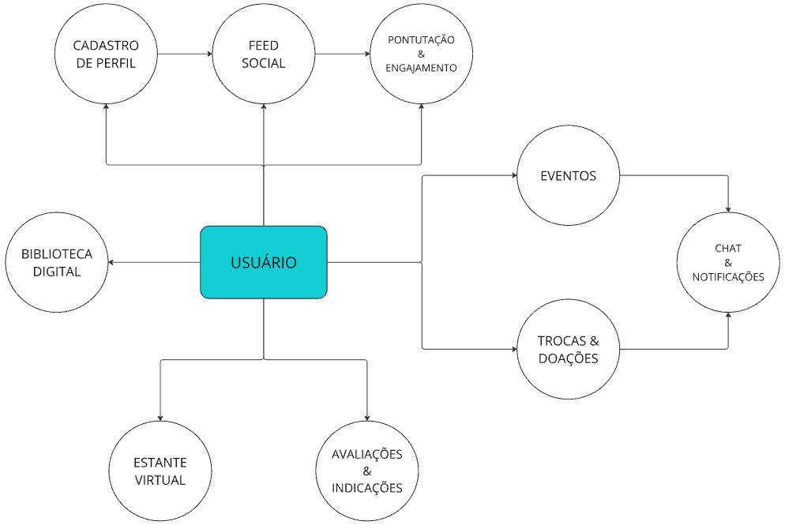

# Introdução

O presente projeto se destina à construção de uma comunidade online para leitores, visando o incentivo à leitura e à promoção do compartilhamento de livros. Através da aplicação a ser desenvolvida, a Plataforma "SAVEBOOK", os usuários poderão trocar e doar livros, fazer indicações de obras, gerir suas leituras de interesse e outras funcionalidades a serem aprofundadas posteriormente, as quais promoverão a interação entre os membros da comunidade. Além de promover a interação e troca entre os usuários, suas gestões individuais e recomendações personalizadas, a aplicação também fornecerá obras de domínio público que podem ser baixadas pelos usuários.

Nas atuais circunstâncias vividas, com o aprofundamento do uso de telas e consumo desenfreado de entretenimento digital, é de suma importância o incentivo ao hábito de leitura, o que constitui o principal objetivo do projeto. Ainda nesse escopo, mostra-se como um grande entrave à prática da leitura as dificuldades econômicas enfrentadas pelo público jovem e a alta nos preços dos livros, pelo que as trocas, doações, e disponibilização de livros contribuem para diminuir tal barreira. Segundo Barbosa e Lima (2020), "o aumento dos preços dos livros tem sido um obstáculo para o público jovem, que frequentemente não possui recursos suficientes para comprar obras novas, limitando, assim, o acesso ao conhecimento e à cultura". É nesse contexto que as funcionalidades do “SAVEBOOK” ganham importância. A possibilidade de troca e doação de livros, além de permitir o compartilhamento entre os usuários, também proporciona o acesso a obras que, de outra forma, estariam fora do alcance de muitos.

Favorecendo a inclusão cultural e educacional, o projeto “SAVEBOOK” busca construir uma aplicação web e mobile interativa e dinâmica, com o objeto de formar e integrar leitores críticos e conscientes. De acordo com, Gomes e Silva (2021), "a criação de comunidades de leitores online, com funcionalidades voltadas à interação e ao compartilhamento de experiências, tem o poder de transformar o simples ato de ler em uma experiência coletiva e dinâmica". Dessa forma, o “SAVEBOOK” se coloca como uma resposta inovadora e inclusiva ao problema do distanciamento dos jovens com a leitura e ao custo elevado dos livros, com a criação desse espaço digital.

## Problema

O reduzido índice de leitura entre os jovens é um desafio amplamente debatido na contemporaneidade, sendo significativamente influenciado por fatores como a falta de acesso a livros, o desinteresse pela leitura e o elevado custo de aquisição de materiais impressos. Esse cenário é agravado pelo crescente uso de tecnologias digitais, que, embora proporcionem uma imersão em diversos tipos de entretenimento, muitas vezes afastam os jovens do hábito de ler. A falta de incentivo à leitura e a dificuldade econômica tornam-se barreiras ainda mais significativas, especialmente para aqueles que não têm acesso fácil a livros ou não consideram a leitura uma atividade prazerosa.

 

Como abordagem dessa problemática, propõe-se a elaboração de um mecanismo de incentivo à circulação de livros entre os próprios jovens. Essa iniciativa visa não apenas aumentar o engajamento social, mas também despertar um maior interesse pela leitura, oferecendo uma alternativa mais viável que a compra de livros, ao mesmo tempo em que promove a troca e a doação entre os participantes. Dessa forma, espera-se diminuir as barreiras econômicas associadas ao acesso a livros e criar uma cultura de leitura mais inclusiva e acessível. Ao possibilitar que livros circulem mais rapidamente entre os usuários, a proposta busca integrar a leitura ao seu universo cotidiano e digital, tornando-a mais atraente e conectada aos seus interesses.

 

Utilizando essa estratégia, a intenção é incentivar um ambiente em que a leitura se torne uma prática compartilhada e acessível, resgatando o valor do aprendizado como fonte de entretenimento, além de promover uma maior interação social. Essa abordagem pode ser crucial para transformar a forma como os jovens se relacionam com a literatura, criando novas possibilidades de acesso e de engajamento com o universo literário.

## Objetivos

O objetivo geral deste trabalho é fomentar o hábito da leitura entre adolescentes e jovens adultos, abordando a barreira econômica que frequentemente impede o acesso a livros e criando uma comunidade de apoio mútuo e fortalecimento. Para alcançar essa meta, busca-se estabelecer uma plataforma que não apenas facilite o acesso a materiais de leitura, mas que também promova o engajamento dos usuários por meio de uma interação social enriquecedora.

Especificamente, os objetivos incluem:
- 
Ampliar o Acesso a Livros: facilitar a troca e doação de livros entre os usuários, criando uma rede de compartilhamento que possibilite a circulação de obras literárias. Além disso, oferecer livros de domínio público para download gratuito, com o intuito de garantir que clássicos da literatura e outras obras relevantes estejam ao alcance de todos. A plataforma também deve sugerir livros de baixo custo e destacar iniciativas que tornem o acesso à leitura mais acessível;

- 
Promover a Interação Social: desenvolver um ambiente digital onde os leitores possam criar perfis, compartilhar suas leituras, trocar recomendações e participar de discussões sobre obras literárias. A criação de grupos temáticos e clubes de leitura proporcionará um espaço para debates e reflexões, aproximando os membros da comunidade e fortalecendo o espírito de colaboração;

- 
Estimular o Interesse pela Leitura: organizar desafios literários, eventos culturais e atividades interativas que despertem o gosto pela leitura. A plataforma também oferecerá conteúdos como resenhas, curiosidades e sugestões de leitura, com o propósito de apresentar novos autores, gêneros e obras, tornando a experiência de leitura mais envolvente e dinâmica;

- 
 Construir uma Comunidade de Leitores:** criar uma rede de apoio onde os leitores possam trocar experiências, sugerir leituras e colaborar para o crescimento intelectual uns dos outros. A plataforma deve valorizar a diversidade literária, destacando obras de diferentes culturas, temas e autores, além de incentivar a participação ativa dos usuários na construção de uma comunidade acolhedora e plural.

O projeto “SAVEBOOK” pretende não apenas ampliar o acesso aos livros, mas também transformar a leitura em uma atividade coletiva e criativa. Ao fortalecer a conexão entre leitores, o projeto contribui para a formação de uma rede que preza pela troca de conhecimentos e a construção de uma sociedade mais crítica e participativa.

## Justificativa

A leitura exerce um papel fundamental na construção do pensamento crítico, no desenvolvimento intelectual e na formação cultural, sendo uma ferramenta essencial para a inclusão social e o crescimento pessoal. No entanto, estudos como o Retratos da Leitura no Brasil de 2024, realizado pelo Instituto Pró Livro, apontam que essa faixa etária apresenta baixos índices de leitura. Entre os principais fatores que dificultam o acesso aos livros estão o alto custo das obras e a falta de estímulo adequado para a criação do hábito de leitura. De acordo com Oliveira e Mendes (2023), "o acesso limitado a livros, somado à ausência de iniciativas que promovam a leitura entre os jovens, contribui para o afastamento desse público do universo literário".

 

Diante desse cenário, a criação da plataforma “SAVEBOOK” se apresenta como uma solução para diminuir as barreiras econômicas e incentivar o engajamento com a literatura. A proposta de viabilizar a troca e a doação de livros entre os usuários permite que obras circulem entre diferentes leitores, ampliando o acesso ao conhecimento e criando uma rede colaborativa. Além disso, a plataforma incentiva a interação social, aproximando leitores por meio de recomendações personalizadas, grupos de leitura e fóruns de discussão.

 

O uso da tecnologia como ferramenta de incentivo à leitura se mostra uma estratégia eficaz para atrair o público jovem, proporcionando um ambiente dinâmico, acessível e interativo. A criação de desafios literários, atividades temáticas e espaços para troca de experiências contribui para tornar a leitura mais envolvente, fortalecendo o sentimento de pertencimento e a formação de uma comunidade ativa.

## Público-Alvo

O público-alvo do projeto “SAVEBOOK” são jovens entre 15 e 35 anos, que possuem uma boa relação com tecnologia e redes sociais. Este público é caracterizado por ter afinidade com universo digital e utilizar plataformas online como parte do seu cotidiano. Embora o foco principal seja em jovens que já têm o hábito de ler, a plataforma também visa atingir aqueles que ainda não se engajaram no universo literário, oferecendo uma experiência imersiva e prática.

Esses jovens podem ser tanto estudantes quanto profissionais em início de carreira,  leitores e não leitores, com acesso regular à internet e dispositivos móveis. Embora o interesse pela leitura não seja constante em todos, muitos deles são consumidores de conteúdo digital, o que cria uma oportunidade para reverter a situação e transformar o consumo de livros em mais uma forma de entretenimento e aprendizado no ambiente online. A estratégia de tornar a leitura algo social, com a possibilidade de compartilhamento e recomendação de livros, assim, integrando a literatura no seu dia a dia.

O público jovem, por ser muito influenciado por tendências e novidades, apresenta grande potencial de adesão ao projeto, especialmente alinhando com suas formas de consumo digital, que priorizam plataformas rápidas e intuitivas.

# Especificações do Projeto
## Requisitos

 Para a priorização dos requisitos, utilizamos a técnica MoSCoW (Must have, Should have, Could have, Won't have for now), que classifica os requisitos em quatro categorias:

- 
M (Must have): Requisitos essenciais para o funcionamento do sistema;

- 
S (Should have): Requisitos importantes, mas não essenciais na primeira versão;

- 
C (Could have): Requisitos desejáveis que podem ser implementados futuramente;

- 
W (Won't have for now): Requisitos que não serão implementados nesta fase.

 A técnica foi aplicada atribuindo prioridade a cada requisito conforme sua importância para a usabilidade e as funcionalidades essenciais do sistema. Os requisitos classificados como “Must have” foram priorizados para garantir que o sistema atenda ao seu propósito principal: possibilitar a troca e doação de livros entre usuários, além de permitir a organização e avaliação de livros.

 

 Além disso, requisitos classificados como “Should have” foram considerados para enriquecer a experiência do usuário, como a recomendação personalizada de livros e a criação de um ranking dos mais bem avaliados. Já os requisitos “Could have” incluem funcionalidades complementares, como o sistema de pontuação e eventos de troca, que agregam valor, mas não são indispensáveis no lançamento inicial.

 

 Por fim, os requisitos “Won't have for now” foram identificados como funcionalidades que, apesar de relevantes, não serão implementadas nesta versão devido a limitações de tempo, equipe ou infraestrutura.

### Requisitos Funcionais

 Os requisitos funcionais descrevem as principais funcionalidades que o sistema deve oferecer para atender às necessidades dos usuários. Eles foram definidos com base nos objetivos do projeto, garantindo que a plataforma permita o cadastro de usuários, a troca e doação de livros, além da interação social e avaliação das obras.

 A tabela a seguir apresenta os requisitos funcionais do sistema, sua prioridade conforme a técnica MoSCoW e os respectivos responsáveis por sua implementação:

|ID    | Descrição do Requisito | Prioridade | Responsável |
|------|------------------------|------------|-------------|
|RF-001|O sistema deve permitir o cadastro de usuários, incluindo nome, foto e preferências literárias. (Opções de login via Google e Facebook)|M|Amanda Furtado|
|RF-002|O sistema deve permitir que os usuários cadastrem livros disponíveis para troca ou doação, incluindo informações como título, autor, edição, estado de conservação e foto do livro|M|Amanda Furtado|
|RF-003|O sistema deve permitir que os usuários manifestem interesse em livros cadastrados para troca, enviando uma notificação ao dono do livro|M|Diovana Tavares|
|RF-004|O sistema deve oferecer uma "estante virtual" para os usuários registrarem livros lidos, em leitura e desejados|M|Diovana Tavares|
|RF-005|O sistema deve permitir que os usuários avaliem livros com notas de 1 a 5 e deixem comentários, permitindo a filtragem e ordenação das avaliações por data, relevância ou nota|M|Diovana Tavares|
|RF-006|O sistema deve exibir um ranking dos livros mais bem avaliados e recomendados, considerando critérios como número de avaliações, média de notas e popularidade|S|Romário Medeiros|
|RF-007|O sistema deve fornecer recomendações personalizadas de livros com base nos interesses do usuário|S|Romário Medeiros|
|RF-008|O sistema deve disponibilizar livros de domínio público para leitura ou download,  com opções de filtro por gênero, autor ou data de publicação|S|Bárbara Lemos|
|RF-009|O sistema deve possuir um feed social para que os usuários interajam, publiquem resenhas e dicas, podendo curtir e comentar publicações|S|Giovanny Sales|
|RF-010|O sistema deve permitir a troca de mensagens entre usuários para negociação de trocas, garantindo privacidade e histórico de conversas|C|Giovanny Sales|
|RF-011|O sistema deve permitir a criação de eventos de troca de livros, virtuais ou presenciais, com informações como data, local e regras de participação|C|Gianluca de Oliveira|
|RF-012|O sistema deve implementar um sistema de pontuação para incentivar engajamento, recompensando ações como avaliações, trocas e interações no feed|C|Gianluca de Oliveira|
|RF-013|O sistema deve permitir que os usuários sigam outros perfis para acompanhar suas atividades e recomendações|C|Bárbara Lemos|
|RF-014|O sistema deve permitir a criação de listas personalizadas de livros|C|Pedro Andrade|
|RF-015|O sistema deve permitir a denúncia de conteúdos inapropriados, como comentários ofensivos ou spam|W|Pedro Andrade|

Os requisitos funcionais definidos acima representam as principais funcionalidades do sistema e foram organizados conforme sua relevância para garantir a melhor experiência aos usuários. O desenvolvimento seguirá uma abordagem iterativa, priorizando os requisitos Must have para viabilizar o funcionamento essencial do sistema, enquanto os requisitos Should have e Could have serão incorporados progressivamente, conforme a disponibilidade de recursos e a necessidade dos usuários.

Além disso, alguns requisitos possuem interdependências. Por exemplo, o RF-003 (manifestação de interesse por livros) depende diretamente do RF-002 (cadastro de livros para troca ou doação), pois os usuários só podem demonstrar interesse em livros previamente cadastrados. Da mesma forma, a estante virtual (RF-004) está relacionada ao sistema de avaliações (RF-005), pois permite que os usuários registrem livros já lidos e deixem suas resenhas.

  

 Com essa estrutura de requisitos, buscamos garantir que o sistema atenda à sua proposta central de forma funcional e intuitiva, permitindo que a troca e a avaliação de livros ocorram de maneira eficiente e organizada.

### Requisitos não Funcionais

 Os requisitos não funcionais definem características essenciais para o desempenho, segurança, usabilidade e escalabilidade do sistema. Embora não representem funcionalidades diretas para o usuário, elas são fundamentais para garantir uma experiência fluida, segura e confiável.

 A tabela a seguir apresenta os requisitos não funcionais do sistema, sua prioridade conforme a técnica MoSCoW e os responsáveis por sua implementação:

|ID    | Descrição do Requisito | Prioridade | Responsável |
|------|------------------------|------------|-------------|
|RNF-001|O sistema deve ser responsivo, garantindo compatibilidade com dispositivos móveis e desktops, otimizando a interface para cada tipo de tela|M|Gianluca de Oliveira|
|RNF-002|O sistema deve suportar pelo menos 10.000 usuários simultâneos sem perda significativa de desempenho, com escalabilidade para crescimento futuro|S|Pedro Andrade|
|RNF-003|O tempo de resposta do sistema deve ser inferior a 2 segundos para carregamento de páginas principais|S|Pedro Andrade|
|RNF-004|O sistema deve garantir segurança de dados utilizando criptografia para armazenamento de senhas e dados sensíveis, seguindo as melhores práticas de segurança|M|Romário Medeiros|
|RNF-005|O sistema deve realizar backup diário dos dados armazenados, garantindo recuperação em caso de falhas|S|Romário Medeiros|
|RNF-006|O sistema deve seguir as diretrizes de acessibilidade para garantir o uso por pessoas com deficiência visual ou motora|W|Amanda Furtado|

 Os requisitos não funcionais estabelecem diretrizes fundamentais para garantir que o sistema seja eficiente, seguro e acessível. Aspectos como responsividade (RNF-001) e tempo de resposta (RNF-003) são essenciais para proporcionar uma navegação fluida, especialmente considerando o uso em dispositivos móveis. Da mesma forma, a capacidade de suportar um grande número de usuários simultâneos (RNF-002) garante que a plataforma seja escalável e possa crescer conforme a demanda.

 A segurança também é um fator crítico, sendo abordada por requisitos como a criptografia para armazenamento de senhas (RNF-004) e o backup diário dos dados (RNF-005), que protegem as informações dos usuários e garantem a recuperação em caso de falhas.

Além disso, a implementação desses requisitos deve seguir boas práticas de desenvolvimento para assegurar um sistema robusto e confiável. A priorização definida permite que aspectos essenciais sejam implementados inicialmente, enquanto melhorias contínuas podem ser incorporadas em versões futuras para otimizar o desempenho e a experiência do usuário.

## Restrições

 As restrições do projeto estabelecem os limites e condições que devem ser seguidos durante o desenvolvimento do sistema. Elas incluem fatores técnicos, operacionais e estratégicos que influenciam a escolha de tecnologias, infraestrutura e metodologia de desenvolvimento. Essas limitações garantem que o projeto seja viável dentro dos recursos disponíveis e esteja alinhado com os objetivos definidos pela equipe.

|ID| Restrição                                             |
|--|-------------------------------------------------------|
|01|O sistema deve ser desenvolvido utilizando apenas tecnologias e ferramentas gratuitas ou open-source, priorizando frameworks amplamente suportados|
|02|O tempo de desenvolvimento não deve exceder 03 meses, garantindo entrega dentro do prazo definido|

As restrições definidas neste projeto são fundamentais para orientar as decisões técnicas e estratégicas da equipe, garantindo que o desenvolvimento do sistema ocorra dentro dos limites estabelecidos. A escolha por tecnologias gratuitas e open-source (Restrição 01) possibilita um desenvolvimento acessível e sustentável, evitando custos adicionais com licenciamento. Da mesma forma, a infraestrutura escalável (Restrição 05) assegura que o sistema possa crescer conforme a demanda, sem comprometer a experiência do usuário.

A preocupação com segurança e privacidade também é evidente, refletida na autenticação sem dependência de serviços pagos (Restrição 03) e na conformidade com boas práticas de proteção de dados. Isso garante que os usuários possam utilizar a plataforma de forma segura, sem riscos desnecessários para suas informações pessoais.

Além disso, a equipe de desenvolvimento se compromete a realizar todo o trabalho internamente (Restrição 04), o que reforça a autonomia do projeto e permite um maior controle sobre sua evolução. No entanto, essa decisão exige um planejamento eficiente para garantir que todas as funcionalidades essenciais sejam implementadas dentro do prazo previsto.

Essas restrições não apenas impõem limites, mas também orientam a equipe a buscar soluções inovadoras e eficientes para garantir que o sistema atenda às suas finalidades sem comprometer a qualidade ou a experiência dos usuários. Conforme o projeto avança, algumas restrições poderão ser reavaliadas para possibilitar melhorias e expansão futura da plataforma.

# Catálogo de Serviços

A plataforma “SAVEBOOK” oferece uma ampla variedade de serviços voltados para a promoção do acesso à leitura, incentivo à troca de livros e interação entre leitores. A plataforma foi projetada para proporcionar uma experiência fluida e intuitiva, permitindo que os usuários encontrem e compartilhem livros de maneira simples e eficiente.

Além dos serviços principais, como o cadastro de usuários, troca e doação de livros e avaliação de obras, a plataforma também oferece funcionalidades adicionais que enriquecem a experiência do usuário. Entre elas, destacam-se o feed social, que promove discussões e interações entre leitores, o sistema de recomendação personalizada, que ajuda a descobrir novos títulos de interesse, e a biblioteca digital de domínio público, que democratiza o acesso à literatura.

O catálogo de serviços descrito a seguir detalha as funcionalidades que serão disponibilizadas no sistema, organizadas conforme suas principais categorias de uso.

## Cadastro e Gerenciamento de Usuários
- Permite que os usuários criem uma conta com nome, foto de perfil e preferências literárias;
- Suporte para login via e-mail/senha e redes sociais (Google, Facebook, etc.);
- Edição de perfil, incluindo atualização de preferências, fotos e informações pessoais.

## Catálogo de Livros para Troca e Doação
- Possibilita o cadastro de livros disponíveis para troca ou doação;
- Os usuários podem fornecer informações detalhadas, como título, autor, edição, estado de conservação e imagens do livro;
- Sistema de busca e filtros para facilitar a localização de livros disponíveis.

## Manifestação de Interesse e Negociação
- Usuários podem demonstrar interesse em livros cadastrados para troca/doação;
- O proprietário do livro recebe uma notificação e pode aceitar ou recusar o pedido;
- Sistema de mensagens interno para negociação entre usuários interessados.

## Biblioteca Virtual e Organização de Leituras
- Cada usuário possui uma "estante virtual" onde pode registrar livros lidos, em leitura e desejados;
- Possibilidade de criar listas personalizadas, como "Favoritos" ou "Livros para 2024";
- Integração com o sistema de troca para indicar disponibilidade de livros físicos.

## Avaliação e Recomendações de Livros
- Usuários podem avaliar livros com notas de 1 a 5 e deixar comentários;
- Sistema de ranking dos livros mais bem avaliados, considerando número de avaliações e média de notas;
- Sugestões personalizadas de livros com base nas preferências e histórico de leitura do usuário.

## Biblioteca Digital de Domínio Público
- Disponibilização de livros de domínio público para leitura online ou download;
- Filtros por gênero, autor e ano de publicação.

## Feed Social e Interação entre Usuários
- Um espaço onde os usuários podem compartilhar resenhas, discutir livros e trocar recomendações;
- Possibilidade de curtir e comentar postagens de outros leitores;
- Opção de seguir outros usuários para acompanhar suas atividades.

## Criação e Participação em Eventos
- Serviço que permite a organização de eventos presenciais ou virtuais para troca de livros;
- Usuários podem criar eventos informando data, local e regras de participação;
- Notificações para lembrar os participantes sobre eventos futuros.

## Sistema de Pontuação e Engajamento
- Os usuários recebem pontos ao realizar ações como cadastrar livros, trocar, avaliar e interagir no feed;
- Possibilidade de alcançar diferentes níveis de engajamento na plataforma;
- Pontuações podem ser usadas para destacar perfis mais ativos e incentivar o uso do sistema.

_Imagem 01 - Fluxograma representando a interação do usuário com o catálogo de serviços._

 A ilustração acima representa a estrutura organizacional dos serviços disponibilizados pela plataforma “SAVEBOOK”, destacando a relação entre suas funcionalidades principais. O usuário está no centro da experiência, acessando e interagindo com os diversos serviços oferecidos. O sistema de cadastro e perfil estabelece a base para participação na plataforma, enquanto módulos como troca e doação de livros, avaliações e indicações, e a biblioteca virtual proporcionam ferramentas para a gestão do acervo pessoal e a descoberta de novos títulos. Além disso, elementos como o feed social e a criação de eventos promovem maior interação entre os leitores, fortalecendo o aspecto comunitário da plataforma. Recursos adicionais, como chat e notificações, garantem uma comunicação eficiente, enquanto o sistema de pontuação e engajamento incentiva a participação ativa dos usuários. Dessa forma, a SAVEBOOK se estabelece como um ecossistema completo para o compartilhamento e valorização da leitura.

# Arquitetura da Solução

 A arquitetura da plataforma “SAVEBOOK” é baseada em uma estrutura modular de três camadas: apresentação, aplicação e dados. O frontend será desenvolvido com React e React Native, enquanto o backend utilizará Node.js com Express para gerenciar a lógica do sistema. Os dados serão armazenados em MongoDB, hospedado na Azure. Além disso, a plataforma contará com Firebase Authentication para autenticação, Firebase Cloud Messaging para notificações e será hospedada em Heroku e Vercel, garantindo escalabilidade e desempenho. O diagrama a seguir ilustra a relação entre esses componentes.

.png)
_Imagem 02 - Fluxograma representando a arquitetura de solução_

## Tecnologias Utilizadas

 Para atender aos requisitos funcionais da aplicação, foi escolhida uma combinação de tecnologias que facilita tanto o desenvolvimento quanto a experiência do usuário. No frontend, a biblioteca React será utilizada para desenvolver a interface web, proporcionando uma experiência interativa e dinâmica.

 Para a versão mobile, será aplicado o React Native, que permite criar aplicativos nativos para iOS e Android a partir de um único código-base, garantindo uma experiência consistente em diferentes dispositivos. Para simplificar o desenvolvimento e a configuração inicial, poderá ser utilizado o Expo, que oferece uma série de ferramentas que aceleram o processo de desenvolvimento mobile.

 No backend, o Node.js com o framework Express será utilizado para construir a API que gerencia a lógica do servidor e a comunicação com o banco de dados. A escolha do Node.js se deve à sua capacidade de usar JavaScript em todo o stack, permitindo que seja utilizada a mesma linguagem para trabalhar no frontend e backend.

 Para a autenticação de usuários via Google e Facebook, será integrado o Firebase Authentication, que simplifica o processo de login social e garante segurança e confiabilidade.

 Para armazenar dados, MongoDB mostra-se como a opção inicial, um banco de dados NoSQL que oferece flexibilidade e escalabilidade, essenciais para gerenciar as informações dos usuários, livros e interações dentro da aplicação. O Mongoose é aplicado como uma camada de modelagem de dados, o que facilita a interação com o MongoDB e garante que os dados sejam validados e estruturados corretamente. A escolha do MongoDB se justifica pela necessidade de lidar com dados variados, como perfis de usuário, detalhes de livros e avaliações, de maneira eficiente.

 Além disso, a aplicação poderá utilizar o Firebase Cloud Messaging para enviar notificações aos usuários quando manifestarem interesse em um livro, garantindo que os usuários proprietários dos livros sejam informados rapidamente sobre potenciais trocas ou doações.

 Para a interface do usuário, será adotado o Tailwind CSS, que permite um design responsivo e moderno com facilidade, ajudando a criar uma "estante virtual" visualmente atraente onde os usuários podem registrar e organizar seus livros lidos, em leitura e desejados.

 Finalmente, para o controle de versão e colaboração entre desenvolvedores, utilizamos Git e GitHub.

 Essa combinação de tecnologias não apenas atende aos requisitos funcionais da aplicação, mas também proporciona uma base sólida e acessível de desenvolvimento, proporcionando aos usuários uma experiência atrativa, consistente e estável.

## Hospedagem

Para o deploy e hospedagem da aplicação, serão utilizadas plataformas como Heroku ou Vercel, que oferecem integrações simples e automatizadas, facilitando o gerenciamento e a atualização contínua do sistema.

 Para o gerenciamento e hospedagem do banco de dados, serão utilizadas instâncias Azure, que oferece um serviço de banco de dados gerenciado, altamente escalável e de baixa latência, bem como suporta múltiplos modelos de dados, incluindo documentos NoSQL como o MongoDB, o que se alinha perfeitamente com as necessidades do presente projeto.

 A combinação dessas escolhas permite que a aplicação cresça de forma confiável e eficiente, enquanto simplifica o gerenciamento e a manutenção do banco de dados.

# Bibliografia

  BARBOSA, A. F.; LIMA, P. G.. O aumento do preço dos livros e o impacto no acesso à leitura no Brasil. São Paulo: Editora Cultura, 2020.

 GOMES, M. C.; SILVA, T. P. Plataformas digitais e a transformação do hábito de leitura entre jovens. Rio de Janeiro: Editora Educação, 2021.

 Retratos da Leitura no Brasil. Instituto Pró Livro. Ministério da Cultura, 2024. Disponível em: https://www.prolivro.org.br/wp-content/uploads/2024/11/Apresentac%CC%A7a%CC%83o_Retratos_da_Leitura_2024_13-11_SITE.pdf. Acesso em: 18 fev. 2025.

 BEZERRA, Raphael. Mais da metade dos jovens brasileiros tem pouco ou nenhum hábito de leitura e é desafio para educação. Jornal Opção, 24 jul. 2024. Disponível em: Mais da metade dos jovens brasileiros tem pouco ou nenhum hábito de leitura e é desafio para educação. Acesso em: 19 fev. 2025.

 Relatório Jovens na Ibero-América 2021: 67% dos jovens brasileiros afirmam gostar de ler, mas leem apenas dois livros em média por ano. Instituto Pró Livro, 24 out. 2022. Disponível em: https://www.prolivro.org.br/2022/10/24/relatorio-jovens-na-ibero-america-2021-67-dos-jovens-brasileiros-afirmam-gostar-de-ler-mas-leem-apenas-dois-livros-em-media-por-ano/. Acesso em: 20 fev. 2025.

 OLIVEIRA, A. F.; MENDES, R. P. A leitura entre os jovens: desafios e soluções para o acesso aos livros. São Paulo: Editora Cultura, 2023.

 INSTITUTO PRÓ LIVRO. Retratos da Leitura no Brasil 2024. São Paulo: Instituto Pró Livro, 2024.

